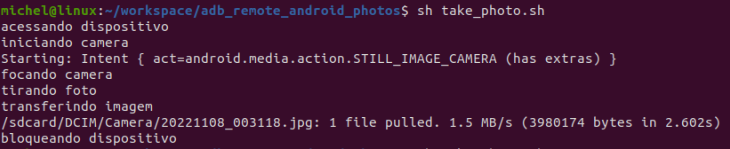

# Captura remota de fotos de um dispositivo Android
Bash script para a captura remota de fotos em dispositivos Android via linha de comando usando [ADB](https://developer.android.com/studio/command-line/adb?hl=pt-br).

Com ele, celulares velhos (por exemplo) podem ser transformados em insuspeitas câmeras de segurança.

## Executando o script
Veja os [requisitos](#requisitos). Na linha de comando, execute: `sh take_photo.sh`

O script irá:
1. desbloquear o dispositivo;
2. inicializar a câmera e focalizá-la;
3. tirar a foto;
4. bloquear o dispositivo e 
5. transferir o arquivo (JPG) da câmera (diretório `/sdcard/DCIM/Camera/`) para o host, no diretório onde foi executado o script.

A saída no console será:



## O que é o ADB
Da [documentação](https://developer.android.com/studio/command-line/adb?hl=pt-br):
>O Android Debug Bridge (adb) é uma ferramenta de linha de comando versátil que permite a comunicação com um dispositivo. O comando adb facilita uma variedade de ações do dispositivo, como instalar e depurar apps, e fornece acesso a um shell Unix que pode ser usado para executar diversos comandos em um dispositivo

Com o ADB, é possível executar comandos em um Android a partir da linha de comando de um outro computador, chamado de host.

## Requisitos

### 1. Instalando o ADB no host

É necessário ter o ADB instalado no host. Execute:

`apt-get install android-tools-adb` (Debian/Ubuntu) 

ou

`sudo yum install android-tools` (Fedora/SUSE)

### 2. Criando uma conexão entre o host e o dispositivo Android

É preciso configurar uma conexão entre o host e o dispositivo Android onde serão executados os comandos, neste caso aqui via **rede Wi-Fi/LAN à qual ambos estejam conectados**. 

Estes passos também estão descritos na [documentação do ADB](https://developer.android.com/studio/command-line/adb?hl=pt-br#wireless)

1. Ative o **modo de depuração USB no dispositivo Android**. Detalhes [aqui](https://developer.android.com/studio/debug/dev-options?hl=pt-br#:~:text=Para%20ativar%20as%20op%C3%A7%C3%B5es%20do,o%20dispositivo%20%3E%20N%C3%BAmero%20da%20vers%C3%A3o).
2. Conecte um **cabo USB entre o host e o dispositivo**.
3. Configure o dispositivo Android para detectar uma **conexão TCP/IP na porta 5555**. No host, execute: 

    `adb tcpip 5555`

    Confirme no dispositivo Android, se necessário.
4. **Encontre o endereço IP do dispositivo Android** na sua rede Wi-Fi/LAN. No Android, vá em Configurações > Configurações de Wi-Fi > Avançado > Endereço IP.
5. Por fim, **estabeleça a conexão entre os dois utilizando o IP encontrado**. No host, execute: 

    `adb connect [IP DO DISPOSITIVO ANDROID]`
    
    O cabo USB não é mais necessário, desconecte-o.
6. Opcionalmente, **verifique que a conexão está ativa**. Execute: `adb devices`. O resultado deverá ser algo como:
```
List of devices attached
192.168.100.6:5555	device
```